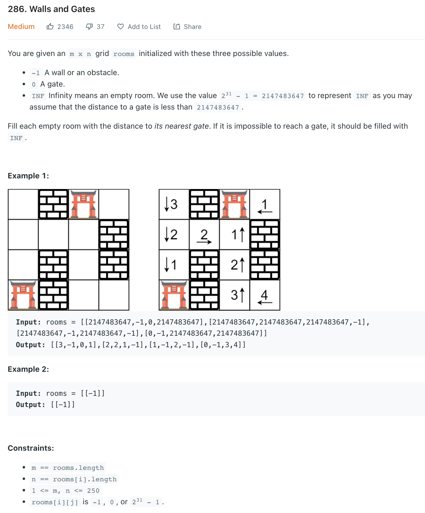

# CodingPractice

## 2D Array

| Topic | Question | Difficulty | Techniques | Solution |
| ----- | -------- | ---------- | ---------- | -------- |
|2D Array|[286. Walls and Gates](https://leetcode.com/problems/walls-and-gates/)|Medium| BFS | [CLICK](./essentials/286-Walls-And-Gates-BFS.java)
|2D Array|[286. Walls and Gates](https://leetcode.com/problems/walls-and-gates/)|Medium| DFS | [CLICK](./essentials/286-Walls-And-Gates-DFS.java)

---

### Linked List

| Topic | Question | Difficulty | Techniques | Solution |
| ----- | -------- | ---------- | ---------- | -------- |
|Linked List|[206. Reverse a Linked Lists](https://leetcode.com/problems/reverse-linked-list/)|EASY|  | [CLICK](./essentials/206-Reverse-Linked-Lists.java)
|Linked List|[286. Walls and Gates](https://leetcode.com/problems/walls-and-gates/)|Medium| DFS | [CLICK](./essentials/286-Walls-And-Gates-DFS.java)

(1) 206. Reverse a Linked List

EASY; 

// Input: head = [1,2,3,4,5]
// Output: [5,4,3,2,1]

(2) 92. Reverse Linked List II (M, N Reversals)

MEDIUM; 

// Input: head = [1,2,3,4,5], left = 2, right = 4
// Output: [1,4,3,2,5]

---

### Stack

| Topic | Question | Difficulty | Techniques | Solution |
| ----- | -------- | ---------- | ---------- | -------- |
|Stack|[20. Valid Parentheses](https://leetcode.com/problems/valid-parentheses/)|EASY|  | [CLICK](./essentials/20-Valid-Parentheses.java)
|Stack|[1249. Minimum Remove to Make Valid Parentheses](https://leetcode.com/problems/minimum-remove-to-make-valid-parentheses/)|Medium| Critical Thinking | [CLICK](./essentials/1249-Minimum-Remove-to-Make-Valid-Parentheses.java)

---

## Resources

(1) Amazon LP Questions

https://leetcode.com/discuss/study-guide/2004928/Amazon-LP-Questions

(2) Two pointer questions

https://leetcode.com/discuss/study-guide/1688903/Solved-all-two-pointers-problems-in-100-days

(3) Dynamic Programming - Study Guide

https://leetcode.com/discuss/study-guide/1592123/New-Learning-Resource-for-premium-users-Detailed-Explanation-of-Dynamic-Programming

(4) Amazon Interview Question Lists by topic

https://www.interviewkickstart.com/interview-questions/amazon-interview-questions

https://www.interviewkickstart.com/interview-questions/amazon-onsite-interview-questions

https://www.interviewkickstart.com/blog/top-algorithms-for-coding-interview
